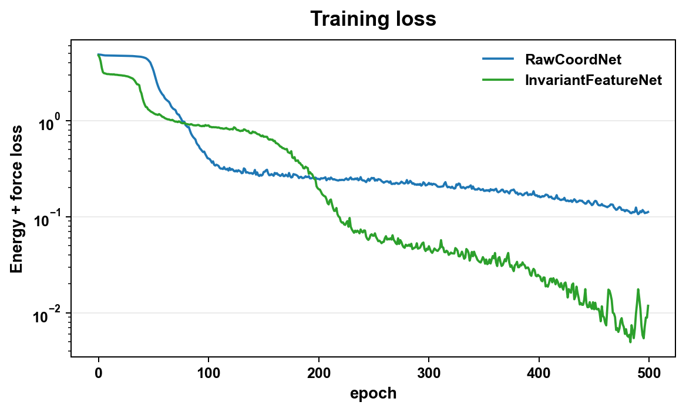
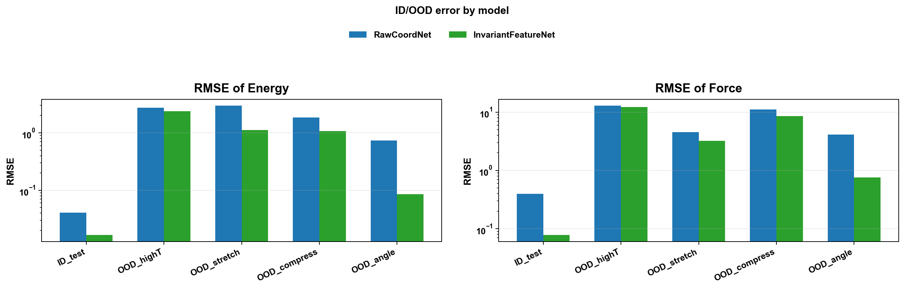
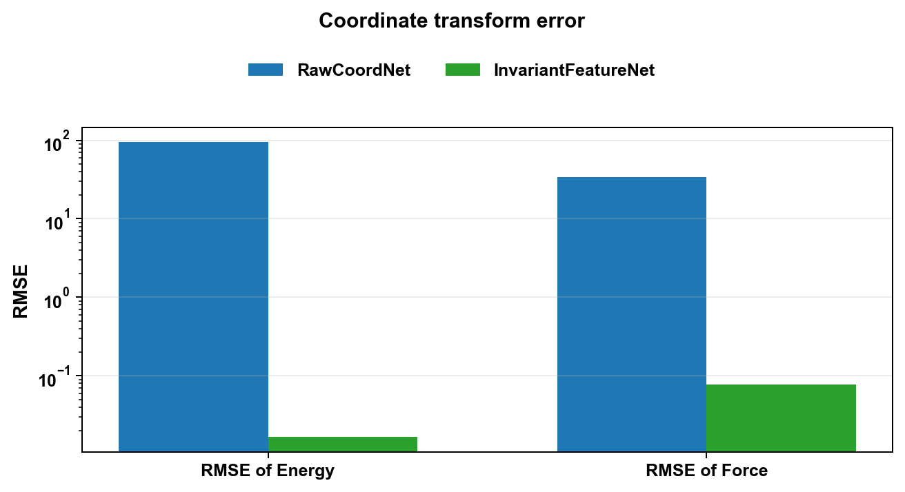
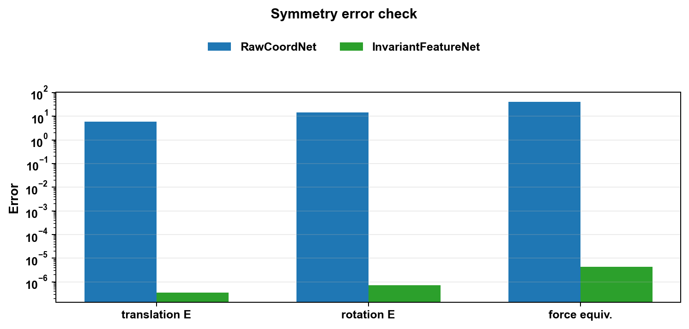
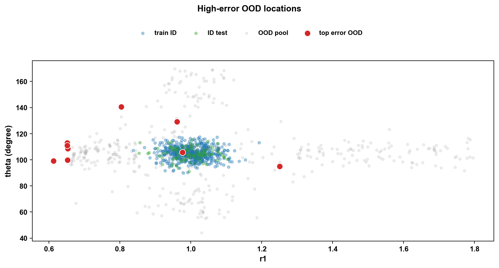
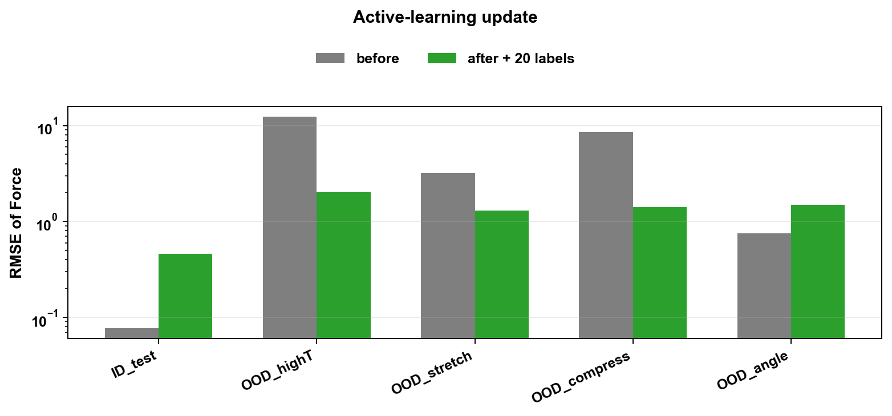

# MLIP_demo

**AI4S 公开课实战：训练一个 toy MLIP，并判断它什么时候不可信**

Toy MLIP Reliability Demo: 从势能面拟合到 OOD 诊断

## 题目描述

“给定一个三维水分子 toy 势能面，本实战首先训练一个轻量神经网络势函数，并通过自动微分从能量得到原子力。随后，学生将检查模型是否满足能量旋转不变性和力旋转等变性，比较模型在 ID 与 OOD 构型上的误差，并利用多模型 committee disagreement 选择下一轮最值得补充标注的构型。通过这个 demo，学生将理解：可靠的 MLIP 不只是一个低测试误差的模型，而是物理约束、数据覆盖与主动学习闭环共同作用的结果。”

## 学习目标

1. 训练一个轻量神经网络势函数，学习构型到能量和力的映射。
2. 检查能量旋转不变性与力旋转等变性，理解物理对称性为什么是 sanity check。
3. 比较 ID / OOD 误差，并用 committee disagreement 与数据回流模拟主动学习闭环。

## 环境依赖

推荐 Python 3.10+。

必需依赖：

```bash
pip install -r requirements.txt
```

本 notebook 不需要 GPU。构型空间图使用 Plotly `FigureWidget`，右侧分子结构使用 `py3Dmol` 的球棍式静态输出；在 VS Code 中需要启用 Jupyter widget 支持。

## 运行方式

在当前目录启动 Jupyter：

```bash
jupyter notebook MLIP_demo.ipynb
```

或使用 JupyterLab：

```bash
jupyter lab MLIP_demo.ipynb
```

也可以用 conda/mamba 创建环境：

```bash
conda env create -f environment.yml
conda activate toy-mlip-reliability
```

所有数据都会在 notebook 中自动生成，不依赖外部数据文件。默认 CPU 即可运行。Section 7 会进行一次轻量主动学习数据回流：将每类 OOD 中选出的高误差构型加入训练集，并从头训练一个新的 InvariantFeatureNet。

## 结果预览

Notebook 运行过程中会把关键静态图保存到 `outputs/figures/`，并生成两个可直接用浏览器打开的交互式 HTML 页面：`outputs/config_space_molecule_viewer.html` 和 `outputs/high_error_ood_molecule_viewer.html`。这些输出可以作为课前预览或课堂讲解材料；即使不运行 notebook，也能先看到主要现象。

训练 loss 用来确认两个势函数是否正常收敛。这里的 loss 同时包含能量和力。



ID/OOD RMSE 对比展示模型在训练分布附近和训练分布之外的误差差异。对数坐标用于突出数量级变化。



坐标变换误差用于检查模型是否能正确处理平移和旋转后的同一个分子构型。



对称性检查进一步比较能量不变性和力旋转等变性，帮助发现模型表示是否违反基本物理约束。



高误差 OOD 构型图把模型最不可靠的点放回构型空间中，便于观察它们是否落在训练数据覆盖不足的区域。



交互式 HTML 页面展示完整构型空间。点击 3D 散点中的任意构型，右侧会显示对应三维水分子的球棍结构。

- `outputs/config_space_molecule_viewer.html`

高误差 OOD 交互式 HTML 页面聚焦模型最不可靠的区域。红色点是 force RMSE 最高的 OOD 构型，点击后可以查看对应分子结构。

- `outputs/high_error_ood_molecule_viewer.html`

主动学习回流图比较补充 OOD 标注前后的 force RMSE，用来说明数据回流对可靠性的影响。



## 交付文件

- `MLIP_demo.ipynb`
- `README.md`
- `requirements.txt`
- `environment.yml`
- `assets/3Dmol-min.js`
- `outputs/figures/*.png`
- `outputs/config_space_molecule_viewer.html`
- `outputs/high_error_ood_molecule_viewer.html`
